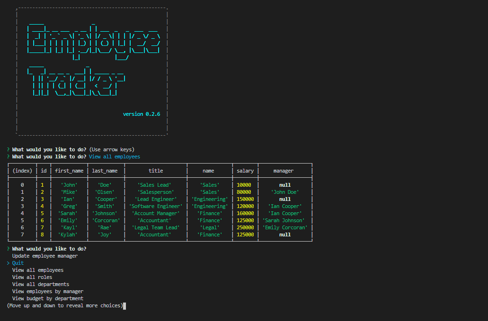

# Employee_Tracker

## Description

An application that allows employers to help manage their company employees. This application utilizes node.js and MySQL as a database to store and query specific sets of data. Npm inquirer is also used to prompt the user on which data they would like access within the employee management database. Some functions this application provides are the ability to add and remove company employees, roles, and departments. The user is also able to update any necessary employee information while also being able to pull reports such as the utility budget for each department. This application demonstrates my ability in being to develop databases through MySQL, and then to connect the database through node.js so the user is able to retrieve and store sets up data.

## Table of Contents

* [License](#license)
* [Contributing](#contributing)
* [Tests](#tests)
* [Screenshot](#screenshot)
* [Questions](#questions)

## License

MIT

## Contributing

Ianaac27

## Tests

## Screenshot

## Questions

If you have any questions, please refer to my contact information below.

[GitHub: Ianaac27](https://www.github.com/Ianaac27)

Email: ian.fleshmancooper@gmail.com
